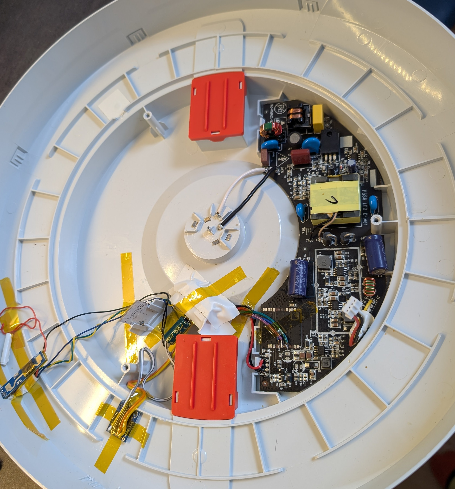

# Yeelight YLXD01YL ESP32-C6 DIY Conversion

This project provides a complete ESPHome-based replacement for the original Wi-Fi controller in the **Yeelight YLXD01YL** (Ceiling Light) using the **Seeed Studio Xiao ESP32-C6**. 

It features native support for the encrypted **YLYK01YL BLE Remote**, advanced presence sensing via **LD2410**, and ambient light monitoring with **BH1750**.

## 🌟 Features

* **Full Local Control**: No cloud dependency, fully integrated with Home Assistant via ESPHome.
* **Encrypted BLE Remote**: Supports the original Yeelight remote (MiBeacon V3) with `bindkey` decryption.
* **Presence & Motion**: Uses the **LD2410** sensor to detect even stationary presence.
* **Auto-Illuminance**: **BH1750** sensor for light-aware automations.
* **Optimized RF**: Hardcoded RF switch configuration for the Xiao ESP32-C6 to use an external antenna for maximum range.
* **Dual Lighting**: Supports main CWWW (Cold/Warm) channels and a dedicated Nightlight channel.

## 📸 The Internals

Here is how the components (Xiao ESP32-C6, sensors, and antenna) are integrated inside the lamp housing:

---

## 🔌 Hardware Configuration & Pinout

### ⚠️ Powering Note (Critical)
The **LD2410** sensor is powered by **3.3V**. While the main header pins are rated for 5V, you must use the **special 3.3V solder pads** on the back of the LD2410 PCB to ensure stability and compatibility with the lamp's power rail and ESP32-C6 logic.

### Try to make the shortest possible connections for the PWM signal (WW,CW,Nightlight) to the lamp to avoid light flickering!

### Pin Mapping Table

| Component | Function | Xiao Pin | GPIO | Notes |
| :--- | :--- | :--- | :--- | :--- |
| **Warm White** | PWM | **D0** | GPIO0 | Warm LED Rail |
| **Cold White** | PWM | **D1** | GPIO1 | Cold LED Rail |
| **Nightlight** | PWM | **D2** | GPIO2 | Dedicated Nightlight LED |
| **I2C SDA** | Sensors | **D4** | GPIO4 | Connect to BH1750 |
| **I2C SCL** | Sensors | **D5** | GPIO5 | Connect to BH1750 |
| **UART RX** | Presence | **D6** | GPIO6 | Connect to LD2410 TX |
| **UART TX** | Presence | **D7** | GPIO7 | Connect to LD2410 RX |
| **RF Enable** | Antenna | - | **GPIO3** | LOW = Enabled |
| **RF Select** | Antenna | - | **GPIO14** | HIGH = External Antenna |

---

## ⚙️ Software Setup

### 1. External Components
This configuration uses the `miot` components by [@dentra](https://github.com/dentra/esphome-components) to handle the encrypted BLE remote.

### 2. Remote Configuration
To use the BLE remote, you need its **MAC Address** and **24-character bindkey** (see how to get them in the @dentra repository).

### 3. Remote Logic
| Button | Action |
| :--- | :--- |
| **ON** | Main Light On (80% @ 4000K) |
| **OFF** | All Lights Off |
| **SUN** | Warm Mode (100% @ 2700K) |
| **+** | Increase Brightness / Long Press: 100% |
| **-** | Decrease Brightness / Long Press: 5% |
| **M** | Toggle Nightlight / Cold Mode |

## 🛠 Installation

1.  Flash the provided `yeelight_c6_xiao_c6.yaml` using ESPHome.
2.  Disconnect the lamp from 230V mains.
3.  Connect the Xiao ESP32-C6 to the LED driver PWM lines.
4.  Mount the LD2410 and BH1750 sensors.
5.  Reassemble and power on.

## 🛡 Disclaimer
Working with mains voltage (230V) is dangerous. This project is for educational purposes. Always ensure the device is unplugged before modification.

## 📜 Credits
* **@Syssi** for inspiration and a lot of knowledge (https://github.com/syssi/esphome-yeelight-ceiling-light/issues/10)
* **ESPHome** for the amazing framework.
* **@dentra** for the MiOT YLYK01YL component.
